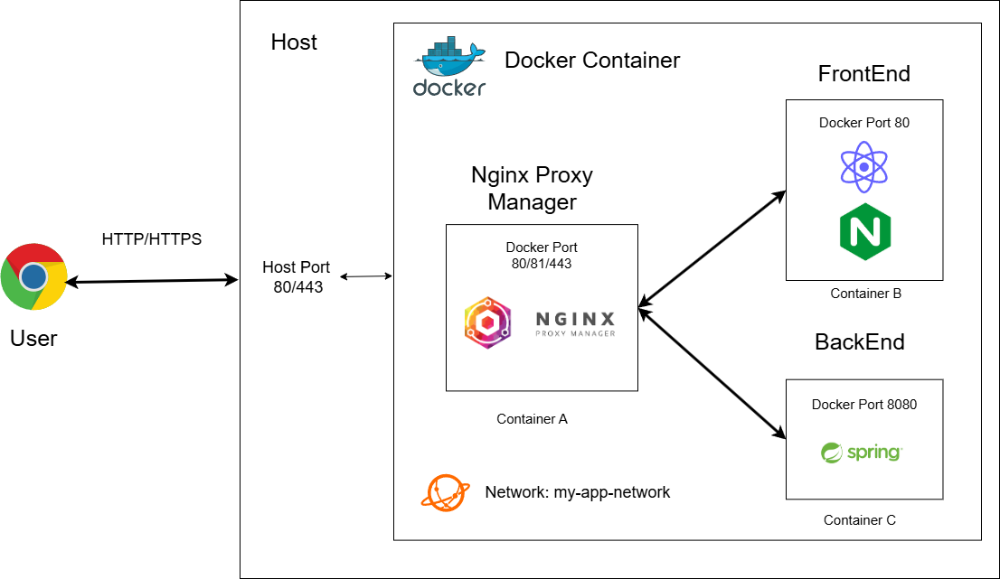

# 🎬 Movie-platform
> React와 Nginx로 구현한 영화 플랫폼 서비스 (프론트엔드)

## 📆 개요

| 항목 | 내용 |
| :---: | :---: |
| 프로젝트 기간 | 2025.9.25 ~ 2025.10.27 |
| 개발인원 | 1인 |

## 🧩 시스템 아키텍처

* 클라이언트 요청은 80/443 포트로 진입합니다.
* 이 요청은 서버의 해당 포트와 매핑된 Nginx Proxy Manager(NPM) 컨테이너가 수신합니다.
* NPM은 SSL 인증서를 적용하여 HTTPS로 암호화하고, 리버스 프록시 역할을 수행합니다.
* NPM은 요청 URL을 분석하여 일반 페이지 요청은 프론트엔드 컨테이너로, /api 경로의 요청은 백엔드 컨테이너로 라우팅합니다.
* NPM, 프론트, 백엔드 컨테이너는 모두 동일한 도커 네트워크에 속해 있어, 내부적으로 컨테이너 이름을 통해 서로 통신합니다.

## 🛠️ 기술 스택

* **Frontend:**
    * React
      
* **Deployment:**
    * Infra: AWS EC2
    * Container: Docker
    * Web Server: Nginx
    * Proxy: Nginx Proxy Manager

* **CI/CD:**
    * GitHub Actions
